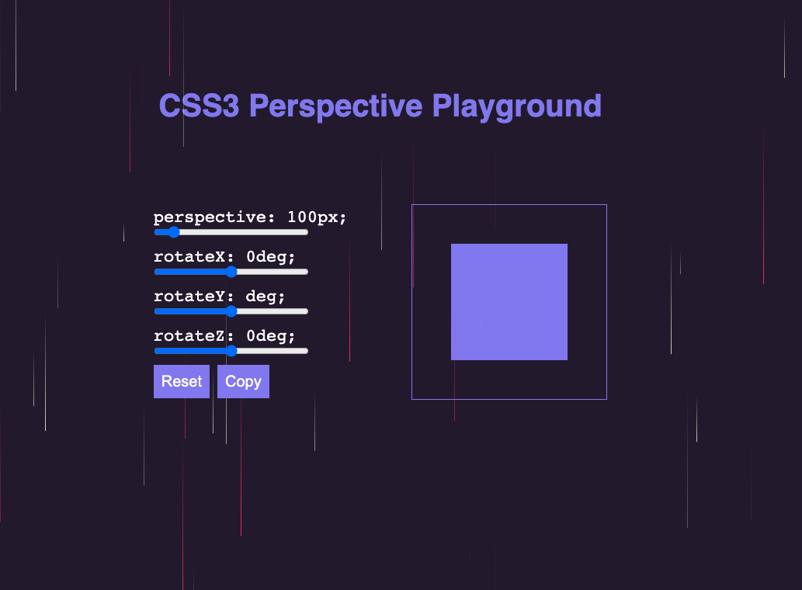

# Perspective-playground

`Udemy project`
###How to use it:
- Change perspective, X, Y, Z
- If you want to reset it, than click on reset button
- You like it? Click on Copy buton and get provided informations

